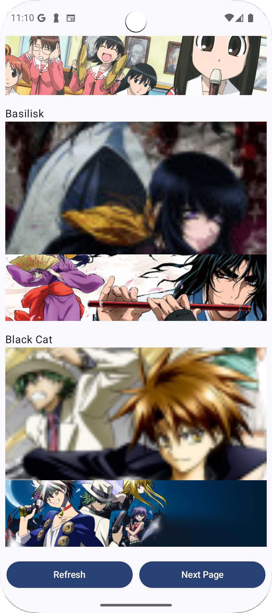

# AnimeList App - GraphQL, Apollo, Jetpack Compose, and Clean Architecture

This project demonstrates a robust Android application for displaying an Anime list, built using modern Android development practices and technologies. It leverages GraphQL via Apollo Client for efficient data fetching, Jetpack Compose for a declarative UI, and a clean architecture for maintainability and testability.

## Technologies Used

* **GraphQL & Apollo Client:** For efficient and flexible data fetching from the Anime API.
* **Jetpack Compose:** For building a modern, declarative UI.
* **Kotlin:** The primary programming language.
* **MVVM (Model-View-ViewModel):** For UI architecture and separation of concerns.
* **Clean Architecture:** For maintainable and testable code.
* **Hilt:** For dependency injection.
* **Retrofit:** For any potential RESTful API calls (if needed, although GraphQL is the primary method).
* **Certificate Pinning:** For enhanced security.
* **Coroutine Flow:** For asynchronous programming and data streams.

## Architecture

The app follows the Clean Architecture principles, dividing the application into distinct layers:

* **Presentation Layer (UI):** Uses Jetpack Compose and ViewModels to display data and handle user interactions.
* **Domain Layer (Use Cases & Entities):** Contains business logic and domain models, independent of specific frameworks.
* **Data Layer (Repositories & Data Sources):** Handles data retrieval from remote (GraphQL via Apollo) and local sources.
* **Data Source Layer:** Handles the implementation of the data sources.

## Screenshots

 **Anime List Screen:** Displays a list of Anime retrieved from the GraphQL API.

   


## Setup Instructions

1.  **Clone the Repository:**
    ```bash
    git clone https://github.com/Asante-Adarkwa-Usman/AnimeListGraphQl.git
    ```

2.  **Open the Project in Android Studio:**
    * Open Android Studio and select "Open an existing Android Studio project."
    * Navigate to the cloned repository and select the project's root `build.gradle` file.

3.  **Configure GraphQL Endpoint:**
    * Ensure that the Apollo Client configuration in the `data` layer points to the correct GraphQL API endpoint.
    * If using an API that requires authentication, configure that in the Apollo Client.

4.  **Certificate Pinning:**
    * The project uses certificate pinning for enhanced security. Replace the placeholder certificate pinning configuration with your API's certificate information.

5.  **Build and Run:**
    * Build the project and run it on an emulator or physical device.

## Project Structure

<pre>
AnimeListApp/
├── app/
│   ├── build.gradle.kts
│   ├── src/
│   │   ├── main/
│   │   │   ├── AndroidManifest.xml
│   │   │   ├── java/
│   │   │   │   └── com/example/animelist/
│   │   │   │       ├── di/           # Hilt Dependency Injection modules
│   │   │   │       ├── data/         # Data layer (repositories, data sources)
│   │   │   │       ├── domain/       # Domain layer (use cases, entities)
│   │   │   │       ├── presentation/ # Presentation layer (ViewModels, UI)
│   │   │   │       ├── navigation/   # Navigation logic
│   │   │   │       ├── ui/           # Jetpack Compose UI components
│   │   │   │       ├── MainActivity.kt
│   │   │   ├── res/
│   │   │   │   └── ...
│   │   ├── test/
│   │   └── androidTest/
├── build.gradle.kts
├── settings.gradle.kts
└── ...
</pre>

## Key Features

* **GraphQL Data Fetching:** Efficient and precise data retrieval using Apollo Client.
* **Jetpack Compose UI:** Modern and declarative UI development.
* **MVVM Architecture:** Clean separation of UI logic and data.
* **Clean Architecture:** Maintainable and testable codebase.
* **Dependency Injection (Hilt):** Simplified dependency management.
* **Certificate Pinning:** Enhanced security for network requests.
* **Coroutine Flow:** Asynchronous data streams for reactive UI updates.
* **Offline capability:** Caching data when possible.

## Future Improvements

* Implement search and filtering functionality.
* Add pagination for large Anime lists.
* Implement user authentication and personalized recommendations.
* Add offline data caching.
* Add more extensive unit and integration tests.

## Contribution

Contributions are welcome! Please feel free to submit pull requests or open issues for any bugs or feature requests.
